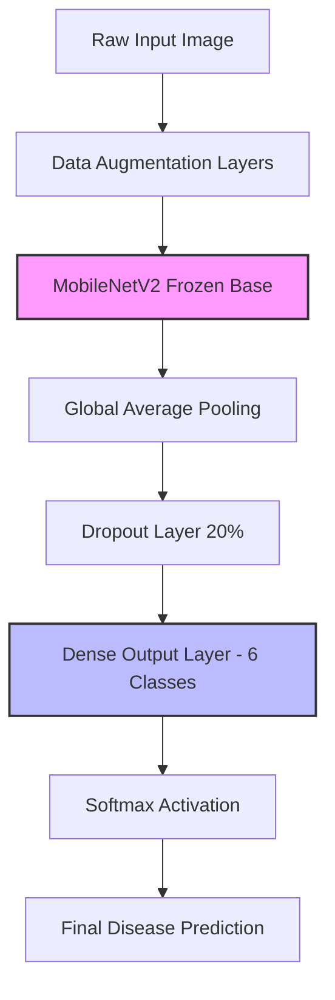

# KrishiCare AI — Machine Learning Explanation Guide (Phase 1)

Welcome! This guide is designed for beginners to understand the code, architecture, and mathematics behind the **KrishiCare AI** crop disease classification system. It explains complex concepts in simple terms without cluttering the source code files.

---

## 1. Directory Structure Purpose

| Folder | What it is used for | Why it matters |
| :--- | :--- | :--- |
| `dataset/train` | **Training Set** | The primary data the AI studies. The network learns patterns, textures, and features of healthy and diseased leaves from these images. |
| `dataset/val` | **Validation Set** | The "practice exam". It helps the developer see if the model is learning correctly during training, guiding hyperparameter tuning without showing the model the final test. |
| `dataset/test` | **Test Set** | The "final exam". Unseen images used at the very end of training to measure how well the AI will perform in the real world. |
| `models/` | **Storage Directory** | Holds large files that shouldn't clog up GitHub: the `.h5` trained weights and performance visualization plots. |
| `src/` | **Source Code Directory** | Houses clean Python scripts (`train_model.py` and `predict_test.py`) along with the generated `class_names.json`. |

---

## 2. Library Deep-Dive

We use a select set of powerful libraries, each serving a vital role in our ML microservice:

* **TensorFlow & Keras**: TensorFlow is Google's open-source machine learning framework, and Keras is its user-friendly interface. Together, they allow us to build, train, and test complex neural network architectures with just a few lines of code.
* **NumPy**: A numerical mathematics library that transforms image matrices into multi-dimensional arrays, allowing computer processors to perform matrix arithmetic at lightning speed.
* **Matplotlib**: A plotting library used to generate training performance curves (`accuracy_plot.png` and `loss_plot.png`) so we can visually evaluate how our model converges.
* **Pillow (PIL)**: A Python Imaging Library used inside the prediction script to open, convert, and resize raw external image files before feeding them to the trained network.

---

## 3. High-Level Concepts & Transfer Learning

### What is Transfer Learning?
Imagine you want to learn how to drive a bus. You don't start by learning how wheels work, how gears engage, or how roads are laid out; you already know that from driving a car. You only focus on the *differences* (size, weight, passenger management).
In AI, **Transfer Learning** is the practice of taking a model trained on a huge dataset (like ImageNet, which contains 1.4 million general images) and applying its knowledge to a specific task (like crop disease leaf detection).

### What is MobileNetV2?
**MobileNetV2** is a state-of-the-art convolutional neural network designed by Google. It is highly optimized to run on mobile phones and edge devices because it uses fewer parameters and computations, making it incredibly fast without losing accuracy.

### Freezing the Base Model
When we set `base_model.trainable = False`, we are **freezing** the feature extraction layers of MobileNetV2. 
* **Why?** The base model already knows how to detect edges, curves, leaf textures, and lighting gradients from its ImageNet training. By freezing it, we ensure its pre-trained knowledge is preserved and not ruined when training begins. We only train the custom classification "head" at the end.

---

## 4. Hyperparameters & Metrics Explained

### IMG_SIZE `(224, 224)`
Images come in various dimensions. To feed them into MobileNetV2, they must be standardized. `224x224` pixels is the optimal resolution that balances rich visual details with high computational speed.

### BATCH_SIZE `32`
Instead of showing the AI all thousands of leaf images at once (which crashes computer memory) or one-by-one (which takes forever), we group them into batches. A batch size of `32` means the network updates its internal weights after looking at 32 images.

### EPOCHS `20`
An epoch is one complete pass through the entire training dataset. Setting `20` epochs means the model will go through and learn from the entire image collection 20 times.

### Accuracy vs. Loss
* **Loss**: A metric showing how wrong the model's predictions are. A lower loss is better. The training algorithm constantly works to minimize this value.
* **Accuracy**: The percentage of images the model got correct. Closer to 100% (or `1.0`) is better.

### Overfitting
Overfitting happens when the AI memorizes the training images instead of learning general rules. It's like a student who memorizes textbook questions but fails the actual exam. The model gets 99% accuracy on training data but performs terribly on validation and test data.

---

## 5. Model Layers & Logic

### Data Augmentation
To battle overfitting, we modify our images in real-time as they go into the network using `RandomFlip`, `RandomRotation`, `RandomZoom`, and `RandomContrast`.
* **The Magic**: By rotating or cropping a single potato leaf image, the model sees a "new" image in every epoch. It prevents memorization and teaches the AI to recognize leaves regardless of lighting, camera angle, or distance.

### GlobalAveragePooling2D
MobileNetV2 outputs a massive 3D tensor of shape `(7, 7, 1280)`. `GlobalAveragePooling2D` averages all the values in each `7x7` grid down to a single value, outputting a flat 1D vector of `1280` numbers. This reduces model complexity and helps prevent overfitting.

### Dropout `(0.2)`
During training, this layer randomly "turns off" 20% of the neurons. 
* **The Magic**: This forces the remaining neurons to work harder and prevents them from relying too heavily on a single cue, leading to a much more robust and cooperative network.

### Dense Output Layer (6 Neurons)
We have exactly six classes of crop health. The final `Dense` layer has exactly 6 neurons, each representing one specific disease class.

### Softmax Activation Function
Softmax takes the raw output scores from the 6 neurons and squashes them into **probabilities** that add up to 1.0 (or 100%). It allows us to say: *"There is a 95% probability this is Potato Late Blight and a 5% probability it is Potato Healthy."*

---

## 6. Training Math & Optimizers

### Adam Optimizer
The optimizer is the algorithm that adjusts the weights of the neural network based on the loss. **Adam** stands for Adaptive Moment Estimation. Think of it as a smart hiker descending a foggy mountain; it adjusts its stride length dynamically based on the steepness of the terrain to reach the bottom (minimum loss) as quickly and safely as possible.

### Categorical Crossentropy Loss
This is the mathematical formula used to calculate the loss for multi-class classification tasks. It compares the model's predicted probability distribution with the actual correct answer (represented as a one-hot encoded vector like `[0, 1, 0, 0, 0, 0]`) and penalizes incorrect, overconfident guesses heavily.

---

## 7. Intelligent Callbacks

Callbacks are functions that execute automatically at the end of every epoch to manage the training process:

* **ModelCheckpoint**: Monitors validation loss and saves the model's weights to `models/krishicare_mobilenetv2.h5` *only* if it performs better than any previous epoch. This guarantees we always keep the best version of our AI.
* **EarlyStopping**: Keeps track of validation loss. If the loss does not improve for `5` consecutive epochs, it stops training early. This saves time and stops the model before it starts overfitting.
* **ReduceLROnPlateau**: If the validation loss stops improving for `3` consecutive epochs, it automatically shrinks the optimizer's learning rate by a factor of 5 (multiplying it by `0.2`). This allows the hiker to take smaller, more careful steps when approaching the bottom of the valley.

---

## 8. Inference: How `predict_test.py` Works

1. **Loads Model & Classes**: Reads the saved `.h5` file and parses the list of labels from `class_names.json`.
2. **Accepts Path Input**: Prompts you for a filepath.
3. **Image Preprocessing**:
   - Opens the image with Pillow.
   - Converts it to RGB (removing transparency channels or converting grayscale to three-channel color).
   - Resizes it to `(224, 224)` matching our model's input expectations.
   - Adds a batch dimension (turning shape `(224, 224, 3)` into `(1, 224, 224, 3)`) because Keras models always expect a batch of images.
4. **Predicts**: Runs `model.predict()`. The model automatically applies its internal `Lambda` preprocessing layer (using MobileNetV2's `preprocess_input`) before sending it to the neural network.
5. **Decodes & Formats**: Finds the highest probability score using `np.argmax()`, translates the raw folder name to a beautiful reader string via `make_readable()`, and multiplies the probability by 100 to print a neat percentage score.

---

## 9. Common Mistakes & Troubleshooting

### Why is my model accuracy stuck at ~16% during training?
* **Problem**: 16.6% accuracy is exactly 1 out of 6 classes (pure guessing). This happens when the model is failing to learn at all.
* **Troubleshooting Steps**:
  1. Ensure you actually placed images in the training/validation subfolders. If directories are empty, TensorFlow won't have anything to train on.
  2. Verify that your images are not corrupted.
  3. Increase the learning rate or check if the dataset has a fair balance of images across all classes.

### What should my training and validation loss curves look like?
* **Healthy Training**: Both curves should decrease smoothly. The validation loss should remain close to the training loss.
* **Overfitting**: The training loss continues to go down to near zero, but the validation loss starts going up. If this happens, your model is memorizing the training set. You may need more training images or a higher dropout rate.
